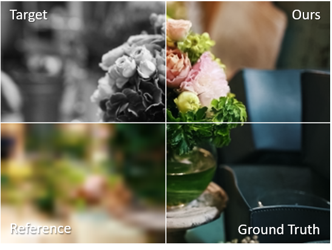

# Cross-Camera Deep Colorization

tSinghua vIsual intelliGence and coMputational imAging lab ( [GitHub](https://github.com/THU-luvision) | [HomePage](http://www.luvision.net/) )

In this repository we provide code of the paper:
> **EFENet: Reference-based Video Super-Resolution with Enhanced Flow Estimation**

> Yaping Zhao, Haitian Zheng, Mengqi Ji, Ruqi Huang

**NEWS (Aug 27, 2022)**: We plan to release the code and model soon in the next few weeks.
